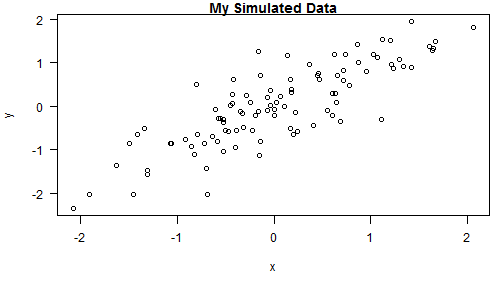

literate statistic programming
=========================================

## 一、提到r代码的可读性  
1. indenting：缩进，设置成8  
2. 右边距，设置成80  


## 二、markdown文件可以很容易地转换成HTML文件，语法很简单  
1. *italics 斜体*    
2. 标题 heading  
    #main heading  
    ##secondary heading  
    ###tertiary heading  
3. unordered list  
 * apple  
 * banana  
 * pear

4. ordered list  
 1. monday  
 2. thuesday  
 3. wednesday  
5. links  
第一种方式：链接指向的地址写在（）里，链接文字写在【】里，到时链接会蓝色下划线。  
    [John Hopkin Bloomberg School of Public Health](http://www.jhsph.edu/)  
    [Download R](http://www.r-project.org/)  
    [RStudio](http://www.rstudio.com/)  
第二种方式： 链接地址写在文章最下方，链接文字写在【】里，后面跟一个链接地址的引用。  
    I spend so much time reading [R blogger][1] and [Simply Statistics][2]!  

6. new lines:在行末加上a double space  

## 三、R markdown，把r代码嵌入到markdown文件中，代码执行的结果也会自动添加到markdown文件中
1. knitr package：convert R markdown to standard markdown
2. markdown package: convert markdown to html
3. when you use knitr in RStudio,you write the RMarkdown（.Rmd) and knitr produce a markdown file (.md),and it convert markdown file into html by default.You should not edit the .md or .html file until you are finished.  
4. slidify package: used to create slides
5. r code chunks    

```r
summary(cars$dist)
```

```
##    Min. 1st Qu.  Median    Mean 3rd Qu.    Max. 
##       2      26      36      43      56     120
```

```r
plot(cars)
```

 
 * you can name a code chunck
 * use "echo=FALSE" in {} after code chunck name(if any),in order to not echo the code in the result .html,but just show the result of the code.

```
##    Min. 1st Qu.  Median    Mean 3rd Qu.    Max. 
##       2      26      36      43      56     120
```
 * use "results=hide" to hide the result of the code chunk,just show the code chunk itself.

```r
  summary(cars$dist)
```
  * use "result=asis" to print the result verbatim.compare with the firstchunk.

```r
  summary(cars$dist)
```

   Min. 1st Qu.  Median    Mean 3rd Qu.    Max. 
      2      26      36      43      56     120 

 * inline text computations  

```r
time <- format(Sys.time(),"%a %b %d %X %Y")  
rand <- rnorm(1)  
```
the current time is 周日 六月 08 13:04:11 2014. the random number produced is -1.2374.  

  * use fig.height=numeric and fig.width to adjust figure size
let's first simulate some data

```r
x <- rnorm(100);
y <- x + rnorm(100,sd=0.5)
```
Here is a scatterplot of the data,use fig.height=4 to adjust figure

```r
par(mar=c(5,4,1,1),las=1)
plot(x,y,main="My Simulated Data")
```

 
  * making tables with xtable  

```r
library(datasets)
data(airquality)
fit <- lm(Ozone ~ Wind + Temp + Solar.R,data=airquality)
summary(fit)
```

```
## 
## Call:
## lm(formula = Ozone ~ Wind + Temp + Solar.R, data = airquality)
## 
## Residuals:
##    Min     1Q Median     3Q    Max 
## -40.48 -14.22  -3.55  10.10  95.62 
## 
## Coefficients:
##             Estimate Std. Error t value Pr(>|t|)    
## (Intercept) -64.3421    23.0547   -2.79   0.0062 ** 
## Wind         -3.3336     0.6544   -5.09  1.5e-06 ***
## Temp          1.6521     0.2535    6.52  2.4e-09 ***
## Solar.R       0.0598     0.0232    2.58   0.0112 *  
## ---
## Signif. codes:  0 '***' 0.001 '**' 0.01 '*' 0.05 '.' 0.1 ' ' 1
## 
## Residual standard error: 21.2 on 107 degrees of freedom
##   (42 observations deleted due to missingness)
## Multiple R-squared:  0.606,	Adjusted R-squared:  0.595 
## F-statistic: 54.8 on 3 and 107 DF,  p-value: <2e-16
```
Here is a table of regression coefficients

```r
library(xtable)
xt <-xtable(summary(fit))
print(xt,type="html")
```

<!-- html table generated in R 3.0.2 by xtable 1.7-3 package -->
<!-- Sun Jun 08 13:04:11 2014 -->
<TABLE border=1>
<TR> <TH>  </TH> <TH> Estimate </TH> <TH> Std. Error </TH> <TH> t value </TH> <TH> Pr(&gt;|t|) </TH>  </TR>
  <TR> <TD align="right"> (Intercept) </TD> <TD align="right"> -64.3421 </TD> <TD align="right"> 23.0547 </TD> <TD align="right"> -2.79 </TD> <TD align="right"> 0.0062 </TD> </TR>
  <TR> <TD align="right"> Wind </TD> <TD align="right"> -3.3336 </TD> <TD align="right"> 0.6544 </TD> <TD align="right"> -5.09 </TD> <TD align="right"> 0.0000 </TD> </TR>
  <TR> <TD align="right"> Temp </TD> <TD align="right"> 1.6521 </TD> <TD align="right"> 0.2535 </TD> <TD align="right"> 6.52 </TD> <TD align="right"> 0.0000 </TD> </TR>
  <TR> <TD align="right"> Solar.R </TD> <TD align="right"> 0.0598 </TD> <TD align="right"> 0.0232 </TD> <TD align="right"> 2.58 </TD> <TD align="right"> 0.0112 </TD> </TR>
   </TABLE>
  * setting global options
  write opts_chunk$set(echo=FALSE,results="hide") in a code chunk, and it will apply to all the chunks.A chunk with its own options will override the default global options.

  * use cache=TRUE option to cache (store) results of computation,after the first run,results are loaded from cache.
    * This option is set on a chunk-by-chunk basis.  
    * If the data or code (or anything external) changes, you need to re-run the cached code chunks.  
    * chunks with significat side effects may not be cacheable  
6. knit2html("document.Rmd")  
  browseURL("document.html")  
  


=============================================
用第二种方式做link的链接地址一定要写在文章末，写在文件中间不生效
[1]:http://www.r-bloggers.com/ "R blogger"  
[2]:http://simplystatics.org/ "Simply Statistics"  
